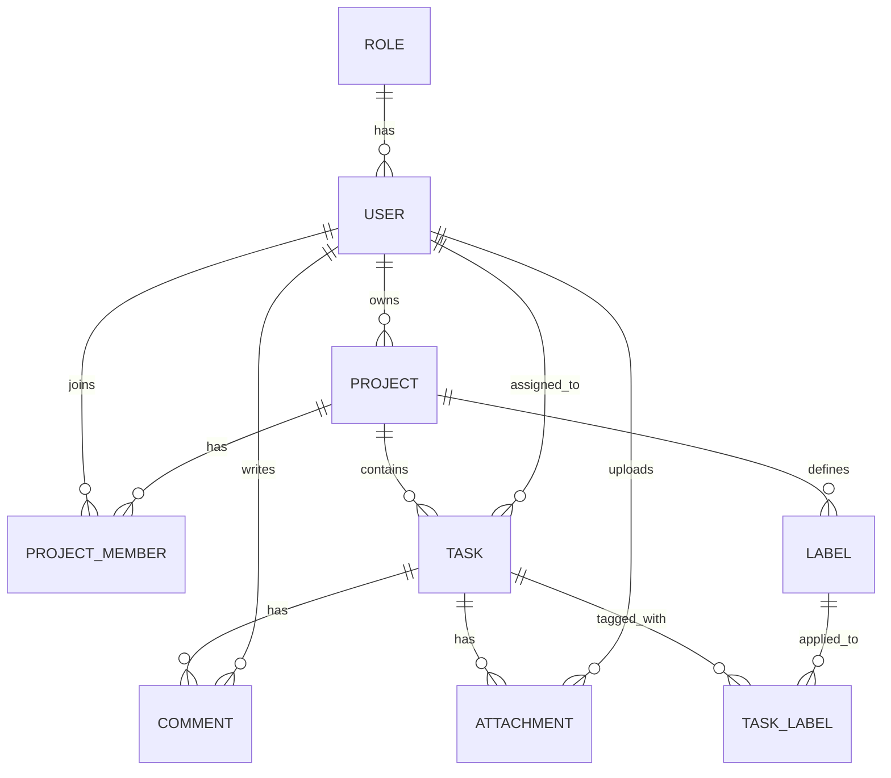

# ✅ Task Manager API
A RESTful backend application for managing projects, tasks, and team collaboration, built with Spring Boot.
The project demonstrates how modern enterprise Java applications are developed using Spring Boot, Spring Security, Hibernate, JWT authentication, RESTful APIs, Docker, Testcontainers, and other popular technologies.
The application allows administrators, project managers, and team members to collaborate on projects through tasks, comments, attachments, and labels, each according to their role's permissions.

---

# Technologies
- Java 21
- Spring Boot
- Spring Security
- Spring Data JPA
- Hibernate
- MySQL
- Liquibase
- JWT
- MapStruct
- Lombok
- Maven
- Swagger / OpenAPI
- Docker
- Testcontainers
- JUnit 5
- Mockito
- MockMvc

---

# Architecture
The project follows a layered architecture.
```
Controller
    ↓
Service
    ↓
Repository
    ↓
Database
```
Main packages:
```
controller/
service/
repository/
model/
dto/
mapper/
security/
config/
validation/
specification/
exception/
```

---

# Roles & Permissions

The application has three roles: **ADMIN**, **PROJECT_MANAGER**, and **TEAM_MEMBER**. Access to each endpoint depends on the authenticated user's role.

## Public (Anyone)
### Auth Controller
| Method | Endpoint | Description |
|--------|----------|--------------|
| POST | `/api/auth/register` | Register a new user |
| POST | `/api/auth/login` | Log in with existing credentials |

## ADMIN

**Users Controller**
| Method | Endpoint | Description |
|--------|----------|--------------|
| PUT | `/users/{id}/role` | Change a user's role |
| GET | `/users/me` | View own profile |
| PUT | `/users/me` | Update own profile (first name, last name, email) |

**Project Controller**
| Method | Endpoint | Description |
|--------|----------|--------------|
| POST | `/api/projects` | Create a project |
| GET | `/api/projects` | Retrieve all projects |
| GET | `/api/projects/{id}` | Retrieve project by ID |
| PUT | `/api/projects/{id}` | Update any project |
| DELETE | `/api/projects/{id}` | Soft delete any project |

**Task Controller**
| Method | Endpoint | Description |
|--------|----------|--------------|
| POST | `/api/tasks` | Create a task |
| GET | `/api/tasks` | Retrieve tasks for a project |
| GET | `/api/tasks/{id}` | Retrieve task by ID |
| PUT | `/api/tasks/{id}` | Update task |
| DELETE | `/api/tasks/{id}` | Delete task |

**Comment Controller**
| Method | Endpoint | Description |
|--------|----------|--------------|
| POST | `/api/comments` | Create a comment |
| GET | `/api/comments` | Retrieve comments |

**Attachment Controller**
| Method | Endpoint | Description |
|--------|----------|--------------|
| POST | `/api/attachments` | Create an attachment |
| GET | `/api/attachments` | Retrieve attachments |

**Label Controller**
| Method | Endpoint | Description |
|--------|----------|--------------|
| POST | `/api/labels` | Create a label |
| GET | `/api/labels` | Retrieve labels |
| PUT | `/api/labels/{id}` | Update a label by ID |
| DELETE | `/api/labels/{id}` | Delete a label |

## PROJECT_MANAGER

**Users Controller**
| Method | Endpoint | Description |
|--------|----------|--------------|
| GET | `/users/me` | View own profile |
| PUT | `/users/me` | Update own profile (first name, last name, email) |

**Project Controller**
| Method | Endpoint | Description |
|--------|----------|--------------|
| POST | `/api/projects` | Create a project |
| GET | `/api/projects` | Retrieve projects they manage |
| GET | `/api/projects/{id}` | Retrieve project by ID |
| PUT | `/api/projects/{id}` | Update their own project |
| DELETE | `/api/projects/{id}` | Soft delete their own project |

**Task Controller**
| Method | Endpoint | Description |
|--------|----------|--------------|
| POST | `/api/tasks` | Create a task |
| GET | `/api/tasks` | Retrieve tasks for a project |
| GET | `/api/tasks/{id}` | Retrieve task by ID |
| PUT | `/api/tasks/{id}` | Update task |
| DELETE | `/api/tasks/{id}` | Delete task |

**Comment Controller**
| Method | Endpoint | Description |
|--------|----------|--------------|
| POST | `/api/comments` | Create a comment |
| GET | `/api/comments` | Retrieve comments |

**Attachment Controller**
| Method | Endpoint | Description |
|--------|----------|--------------|
| POST | `/api/attachments` | Create an attachment |
| GET | `/api/attachments` | Retrieve attachments |

**Label Controller**
| Method | Endpoint | Description |
|--------|----------|--------------|
| POST | `/api/labels` | Create a label |
| GET | `/api/labels` | Retrieve labels |
| PUT | `/api/labels/{id}` | Update a label by ID |
| DELETE | `/api/labels/{id}` | Delete a label |

## TEAM_MEMBER

**Users Controller**
| Method | Endpoint | Description |
|--------|----------|--------------|
| GET | `/users/me` | View own profile |
| PUT | `/users/me` | Update own profile (first name, last name, email) |

**Project Controller**
| Method | Endpoint | Description |
|--------|----------|--------------|
| GET | `/api/projects` | Retrieve projects they belong to |
| GET | `/api/projects/{id}` | Retrieve project by ID |

**Task Controller**
| Method | Endpoint | Description |
|--------|----------|--------------|
| GET | `/api/tasks` | Retrieve tasks for a project (if a project member) |
| GET | `/api/tasks/{id}` | Retrieve task by ID |
| PUT | `/api/tasks/{id}` | Update assigned task only (status, description, due date) |

**Comment Controller**
| Method | Endpoint | Description |
|--------|----------|--------------|
| POST | `/api/comments` | Create a comment (if user belongs to the project) |
| GET | `/api/comments` | Retrieve comments |

**Attachment Controller**
| Method | Endpoint | Description |
|--------|----------|--------------|
| POST | `/api/attachments` | Create an attachment to the assigned task |
| GET | `/api/attachments` | Retrieve attachments (if a project member) |

**Label Controller**
| Method | Endpoint | Description |
|--------|----------|--------------|
| GET | `/api/labels` | Retrieve labels |

---

# Security
Authentication is implemented using JWT tokens.

There are three user roles:
- ADMIN
- PROJECT_MANAGER
- TEAM_MEMBER

Public endpoints are available for registration and login.
All other endpoints require authentication.
Access to resources is further restricted based on project ownership/membership and task assignment, as described above.

---

# Database

The database schema is managed using Liquibase.

## Relationships

| Relationship | Type | Direction |
|--------------|------|-----------|
| User → Role | Many-to-One | Unidirectional |
| User ↔ Owned Projects | One-to-Many | Bidirectional |
| Project ↔ ProjectMember | One-to-Many | Bidirectional |
| User ↔ ProjectMember | One-to-Many | Bidirectional |
| Project ↔ Tasks | One-to-Many | Bidirectional |
| Project ↔ Labels | One-to-Many | Bidirectional |
| User ↔ Assigned Tasks | One-to-Many | Bidirectional |
| Task ↔ Comments | One-to-Many | Bidirectional |
| User ↔ Comments (author) | One-to-Many | Bidirectional |
| Task ↔ Attachments | One-to-Many | Bidirectional |
| User ↔ Attachments (uploadedBy) | One-to-Many | Bidirectional |
| Task ↔ Labels | Many-to-Many | Bidirectional |

## Tables

**users**
| id (PK) | username | password | email | first_name | last_name | role_id (FK) | created_at | updated_at | is_deleted |
|---|---|---|---|---|---|---|---|---|---|

**roles**
| id (PK) | name |
|---|---|

Data: `1 - ADMIN`, `2 - PROJECT_MANAGER`, `3 - TEAM_MEMBER`
Storing roles as data rows (rather than an enum) allows roles to be changed without recompiling the application.

**projects**
| id (PK) | name | description | status | start_date | end_date | owner_id (FK) | created_at | updated_at | is_deleted |
|---|---|---|---|---|---|---|---|---|---|

`owner_id` points to the project creator.

**project_members**
| project_id (PK, FK) | user_id (PK, FK) | joined_at |
|---|---|---|

Composite primary key `(project_id, user_id)`. Without this table, there is no way to know which users belong to a project.

**tasks**
| id (PK) | project_id (FK) | assignee_id (FK) | created_by (FK) | name | description | priority | status | due_date | created_at | updated_at | is_deleted |
|---|---|---|---|---|---|---|---|---|---|---|---|

**comments**
| id (PK) | task_id (FK) | user_id (FK) | text | created_at |
|---|---|---|---|---|

**attachments**
| id (PK) | task_id (FK) | uploaded_by (FK) | dropbox_file_id | filename | upload_date |
|---|---|---|---|---|---|

Files themselves are not stored — only the Dropbox File ID.

**labels**
| id (PK) | project_id (FK) | name | color | created_at |
|---|---|---|---|---|

**task_labels**
| task_id (PK, FK) | label_id (PK, FK) |
|---|---|

Many-to-many join table with composite primary key `(task_id, label_id)`.

---

# Model Diagram


---

# API Documentation

Swagger UI is available after starting the application.
```
http://localhost:8080/swagger-ui/index.html
```

---

# Getting Started

## Clone repository
```bash
git clone https://github.com/<your-account>/<repository>.git
```

## Configure database
Create MySQL database:

```sql
CREATE DATABASE task_manager;
```

Configure
```
application.properties
```

Example:
```properties
spring.datasource.url=jdbc:mysql://localhost:3306/task_manager
spring.datasource.username=root
spring.datasource.password=password
```

## Run the project
```bash
mvn clean install

mvn spring-boot:run
```
Liquibase will automatically create the database schema.

---

# Docker
The project can also be started using Docker.
Create a `.env` file in the project root.

Example:
```
MYSQLDB_USER=root
MYSQLDB_PASSWORD=password
MYSQLDB_ROOT_PASSWORD=password
MYSQLDB_DATABASE=task_manager

MYSQLDB_LOCAL_PORT=3307
MYSQLDB_DOCKER_PORT=3306

SPRING_LOCAL_PORT=8080
SPRING_DOCKER_PORT=8080
DEBUG_PORT=5005
```

Build and start the application:
```bash
docker compose up --build
```

To stop the application:
```bash
docker compose down
```

---

# Testing
The project contains:
- Unit tests
- Integration tests
- Testcontainers
- MockMvc
- Mockito

Run tests:
```bash
mvn test
```

---

# Author
Andrii Alieksieienko
